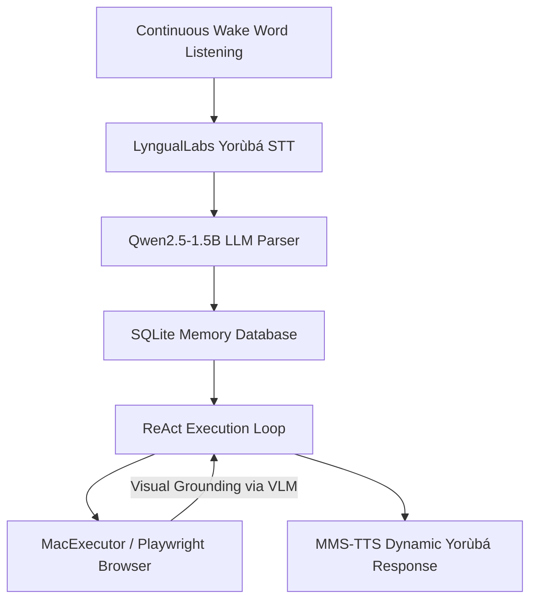

# Àṣẹ Agent — Autonomous Yorùbá Voice Assistant for macOS

> **Àṣẹ** — *"So it is. Let it be done."*

Àṣẹ is a highly modular, fully offline, Yorùbá-language voice assistant for macOS built on Apple Silicon. Speak in Yorùbá (or mixed Yorùbá–English) to control your Mac: open apps, browse the web, search files, type text, and more.

---

## 🚀 Quick Start

```bash
# 1. Clone
git clone https://github.com/sam4rano/Ase_agent.git
cd Ase_agent

# 2. Bootstrap (installs dependencies + downloads ~1.3GB of models)
bash setup.sh

# 3. Grant macOS Permissions
#    System Settings → Privacy → Microphone → enable Terminal
#    System Settings → Privacy → Accessibility → add Terminal

# 4. Run the Agent
source venv/bin/activate
python3 src/main.py
```

See **[instruction.md](instruction.md)** for the deep-dive setup guide.

---

## 🧠 Architecture & Tech Stack

Àṣẹ is built to run entirely locally on an M1/M2/M3 Mac, ensuring absolute privacy and low latency.



| Component | Model / Library |
|---|---|
| **STT Engine** | `LyngualLabs/whisper-small-yoruba` (Fine-tuned Whisper on HuggingFace) |
| **Command Parser** | `mlx-community/Qwen2.5-1.5B-Instruct-4bit` (via MLX) |
| **Wake Word Engine** | `openWakeWord` (Continuous background listening) |
| **Memory & State** | Built-in `sqlite3` for rolling contextual memory |
| **System Control** | `osascript` (AppleScript) + secure `subprocess` allowlist |
| **Browser Agent** | `Playwright` for automated headless/UI browser control |
| **Vision Model (VLM)** | `Qwen/Qwen2-VL-2B-Instruct` for visual grounding coordinates |
| **TTS Engine** | `facebook/mms-tts-yor` (VITS-based offline speech) + `afplay` |

**Memory Footprint (M1 8GB):** The baseline pipeline consumes roughly **~2GB of RAM**, scaling up if the massive VLM model is initialized for visual grounding.

---

## 🗣️ Example Commands

Speak naturally in Yorùbá. The agent understands code-switching and complex multi-step instructions.

| Yorùbá Input | Agent Action |
|---|---|
| `ṣi Chrome` | Opens Google Chrome |
| `lọ si youtube.com` | Opens a new tab and navigates to YouTube |
| `wa Fela Kuti` | Performs a Google Search in your default browser |
| `ya aworan` | Takes a screenshot and saves it to your Desktop |
| `wa faili orin` | Opens Spotlight and searches for files matching "orin" |
| `tẹ play lori youtube` | **Visual Click**: Takes a screenshot, locates the play button using the Vision Model, and clicks it |
| `pa á rẹ` | **Contextual Memory**: Checks the database for the last opened app and forcefully closes it |
| `ṣi Chrome ki o si lọ si github.com` | **Multi-action**: Opens Chrome, then navigates to GitHub |

---

## 🧩 Plug-and-Play Modularity

Àṣẹ is built to be a hacker's playground. You can easily bring your own intelligence models! 
Want to use a different Text-to-Speech model? A custom Wake Word? The architecture strictly separates concerns so you can swap out core components with just a configuration change.

- **Bring Your Own STT**: Swap `LyngualLabs/whisper-small-yoruba` in `config/settings.py` for any HuggingFace ASR pipeline.
- **Bring Your Own TTS**: Swap `facebook/mms-tts-yor` for Flow-Matching architectures like F5-TTS or XTTS simply by updating `src/tts_engine.py`.
- **Bring Your Own LLM**: You can swap the Qwen parser for a local LLaMA-3 model by changing the ID in `config/settings.py` (just ensure you update the JSON system prompt formatting).
- **Custom Wake Words**: Use `openWakeWord` to train a model for your own voice phrase and plug the ONNX file into `src/wake_word.py`.

See **[contributors.md](contributors.md)** for a deep dive into swapping out these engines.

---

## 📚 Documentation

Want to understand how we got here or how to help us reach full autonomy?

- **[forensic.md](forensic.md)** — A deep dive into our engineering journey, the models we tested (and rejected), and the roadmap to making Àṣẹ visually and continuously autonomous.
- **[contributors.md](contributors.md)** — Step-by-step guides on how to swap out the STT/LLM/TTS models and safely add new commands to the MacExecutor.
- **[security.md](security.md)** — Threat model, allowlisting, and system mitigation strategies.
- **[plan.md](plan.md)** — The original architectural phases and success criteria.

---

*Designed for M1/M2/M3 MacBooks. Requires macOS 13+.*
